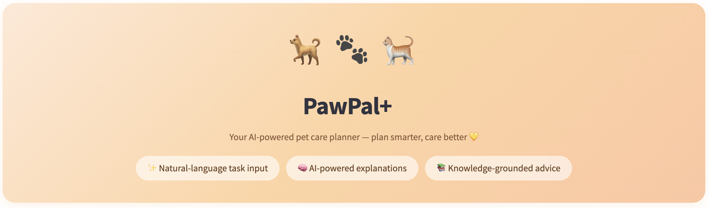
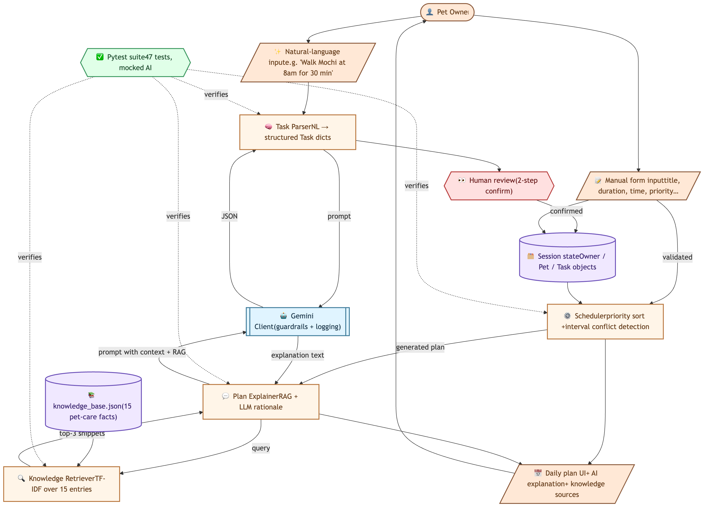
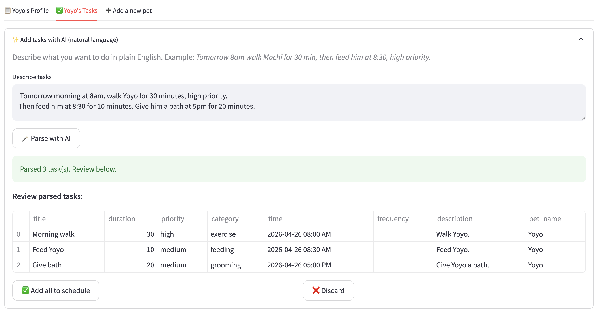
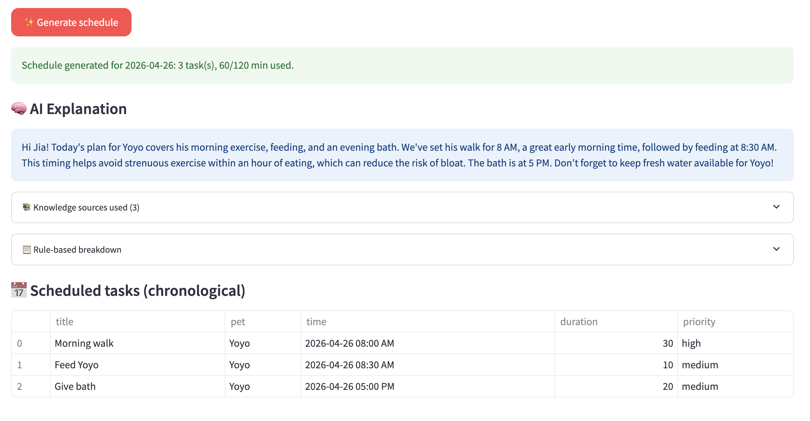
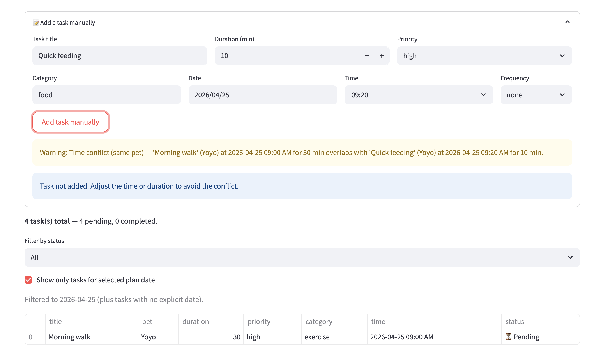

# 🐾 PawPal+ — AI-Powered Pet Care Planner

> **Final project for CodePath AI 110.** PawPal+ helps busy pet owners plan their day around their pets. It combines a deterministic scheduler with three AI features — natural-language task input, plan reasoning, and knowledge-grounded explanations — to deliver personalized, transparent, and reliable daily care plans.



---

## 📌 Original Project (Module 2)

**Base project**: PawPal+ from CodePath AI 110 Module 2.

The original PawPal+ was a Streamlit-based pet care planner where users could manually add tasks (title, duration, priority, time, frequency) and the system would generate a daily plan using a rule-based scheduler. The original implementation handled task sorting by priority, time-conflict detection (start-time only), and recurring task generation, with full pytest coverage of scheduling logic.

This **final project** evolves that foundation into a full applied AI system — adding three integrated AI features (natural-language input, AI explanations, RAG-grounded advice), upgrading the scheduling engine, and rebuilding the UI for end users.

---

## ✨ What's New in This Final Project

| Feature                                  | What It Does                                                                                                                                 | Tech                                      |
| ---------------------------------------- | -------------------------------------------------------------------------------------------------------------------------------------------- | ----------------------------------------- |
| **🪄 Natural-language task input**       | Users describe tasks in plain English ("walk Mochi tomorrow at 8am for 30 min, high priority") and an LLM parses them into structured tasks. | Gemini 2.5 Flash + structured JSON output |
| **🧠 AI plan explanation**               | The generated plan is explained in friendly, contextual language — referencing the pet's age, breed, and the owner's preferences.            | LLM with prompt-injected context          |
| **📚 RAG-grounded advice**               | Explanations are grounded in a local knowledge base of 15 pet-care facts, retrieved via TF-IDF and shown to the user for transparency.       | Hand-built TF-IDF retriever               |
| **⚙️ Interval-aware conflict detection** | Detects partial overlaps (e.g. 9:00–9:30 walk vs 9:20 feed), not just identical start times.                                                 | Refactored scheduler logic                |
| **🛡️ Guardrails & fallbacks**            | Two-step human review on AI-parsed tasks, automatic fallback to rule-based explanation when Gemini fails, validated input fields.            | Try/except + UI confirmations             |

---

## 🏗️ Architecture Overview



PawPal+ is organized into five layers:

1. **Input layer** — natural-language input or manual form, both feeding into the same task model.
2. **AI service layer** — a single `GeminiClient` wrapper handles all LLM calls with structured JSON output, logging, and unified error handling.
3. **Core logic layer** — four modules: `task_parser` (NL → tasks), `knowledge_retriever` (TF-IDF retrieval), `plan_explainer` (RAG + LLM rationale), and `scheduler` (rule-based ordering + conflict detection).
4. **Data layer** — a static `knowledge_base.json` with curated pet-care facts, plus in-memory session state for `Owner`, `Pet`, and `Task` objects.
5. **Human + testing checkpoints** — users review AI-parsed tasks before they enter the schedule (human-in-the-loop), and 47 automated tests verify every core component using mocked LLM calls.

The deliberate two-layer design — **TF-IDF for recall + LLM for precision** — means the retriever casts a wide net while the LLM filters and weaves in only what's relevant. This trade-off is visible to the user via the "Knowledge sources used" panel.

---

## ⚙️ Setup Instructions

### Prerequisites

- Python 3.10+
- A free [Google Gemini API key](https://aistudio.google.com/app/apikey)

### Installation

```bash
# 1. Clone the repository
git clone https://github.com/jh0619/applied-ai-system-project.git
cd applied-ai-system-project

# 2. Create and activate a virtual environment
python -m venv .venv
source .venv/bin/activate          # macOS / Linux
# .venv\Scripts\activate           # Windows

# 3. Install dependencies
pip install -r requirements.txt

# 4. Configure your API key
echo "GEMINI_API_KEY=your_actual_key_here" > .env
```

### Run the App

```bash
streamlit run app.py
```

The app will open at `http://localhost:8501`.

### Run the Tests

```bash
python -m pytest
```

You should see **47 passed** in under 2 seconds.

---

## 🎬 Sample Interactions

### Sample 1: Natural-Language Task Input

**User input** (typed into the AI task box):

> _Tomorrow morning at 8am, walk Yoyo for 30 minutes, high priority. Then feed him at 8:30 for 10 minutes. Give him a bath at 5pm for 20 minutes._

**AI output**: Three structured tasks correctly extracted with proper categories, times resolved against today's date, and pet name auto-matched.



> 💡 Notice the **two-step human review** — users see the parsed result and explicitly confirm before tasks enter the schedule. This is a key guardrail.

---

### Sample 2: AI Explanation + RAG Knowledge Sources

**User action**: Generates a plan for the day after adding the tasks above.

**AI output**: A friendly, contextual explanation that weaves in real pet-care knowledge — and shows users exactly which knowledge entries were retrieved.



> 💡 The expandable "Knowledge sources used" panel makes the AI **auditable**. The LLM only uses facts the user can verify came from the knowledge base — not hallucinated trivia.

---

### Sample 3: Interval-Aware Conflict Detection

**User input**: Manually adds a 9:00 AM walk (30 min) and a 9:20 AM feeding (10 min).

**System output**: Detects that 9:20 falls inside the 9:00–9:30 walk window and warns the user — even though no tasks share an identical start time.



> 💡 Back-to-back tasks (e.g., 9:00–9:30 walk → 9:30 feeding) are correctly **not** flagged. This precision comes from refactoring the scheduler to use interval-overlap math instead of equality checks.

---

## 🎯 Design Decisions

### Why Gemini 2.5 Flash?

Free tier has generous quotas, response times are fast (1–3 seconds), and structured JSON output (`response_mime_type="application/json"`) gives reliable parsing without prompt-engineering acrobatics.

### Why TF-IDF instead of vector embeddings for RAG?

For a 15-entry knowledge base, embedding-based retrieval would be over-engineering — it adds dependencies, cold-start cost, and obscures the "why this snippet" reasoning. Hand-rolled TF-IDF runs in milliseconds, has zero external dependencies, and produces explainable scores users can audit.

### Why two-step human review on AI-parsed tasks?

LLMs occasionally misinterpret ambiguous input ("tomorrow night" → which time exactly?). Showing the parsed result before committing keeps the user in control and catches errors early. This is a deliberate **human-in-the-loop** design choice.

### Why doesn't the AI auto-adjust task durations based on retrieved knowledge?

The knowledge base might say "Golden Retrievers need 60–90 minutes of exercise daily," but the user might only have 30 minutes today. AI suggests; the user decides. Auto-overriding user input would violate the user's authority and assume context the AI doesn't have. The AI gently surfaces gaps in the explanation but never silently rewrites tasks.

### Why a fallback to rule-based explanation?

External services fail. When Gemini is unreachable or returns malformed output, the app degrades to the deterministic `Scheduler.explain_plan()`. The user always gets a usable plan — never an error screen.

---

## 🧪 Testing Summary

**Result**: **47 of 47 automated tests pass** (`python -m pytest`).

Test coverage by module:

| Module                                         | Tests | What's verified                                                              |
| ---------------------------------------------- | ----- | ---------------------------------------------------------------------------- |
| `pawpal_system` (scheduler, tasks, recurrence) | 25    | Sorting, interval conflicts, daily/weekly recurrence, date filtering         |
| `task_parser`                                  | 8     | NL parsing, fallback for invalid fields, pet name matching, error handling   |
| `plan_explainer`                               | 6     | RAG context injection, snippet propagation to UI, error → UI fallback        |
| `knowledge_retriever`                          | 8     | TF-IDF scoring, top-k respect, missing file resilience, empty-query handling |

### What Worked

- **Mocking AI calls** kept the test suite fast (~1s), free, and reproducible — no real Gemini calls during CI.
- **Interval-overlap math** made conflict detection both more accurate and easier to reason about than the original time-equality approach.
- **Returning retrieved snippets to the UI** turned RAG from a black box into an auditable feature, with no extra cost.

### What Didn't Work (And What I Fixed)

- **Initial conflict detection** only caught identical start times. A 9:00 walk + 9:20 feeding silently passed. Refactored to true interval-overlap detection — caught by adding `test_partial_overlap_is_detected`.
- **First version of `plan_explainer`** returned only a string. Adding RAG required also returning the retrieved snippets, which broke 2 tests; updated test signatures to accept `(text, snippets)` tuples.
- **TF-IDF retrieval** sometimes surfaces tangentially related entries (e.g. "senior pet care" for a 2-year-old dog) because pure keyword matching ignores qualifiers like "senior". This is **mitigated by the LLM filtering layer** — the model is prompted to ignore irrelevant snippets — but the retrieval scores remain visible in the UI for transparency.

### What I Learned

- **Mocking is non-negotiable** for testing AI features. Without it, a test run costs money and fails on flaky networks.
- **Guardrails compound**: prompt rules + JSON-mode output + UI human review + test coverage together produce something that actually feels reliable, not just impressive in a demo.
- **RAG isn't magic** — the retrieval layer's job is recall, not precision. Designing for "the LLM will filter" is more honest than pretending the retriever is perfect.

---

## 💭 Reflection: What This Project Taught Me

**1. AI features only matter if they change behavior.**
Bolting an LLM call onto a button isn't AI integration. The natural-language input _replaces_ manual form-filling; the AI explanation _replaces_ a static printout; RAG _grounds_ what would otherwise be hallucinated trivia. Each feature meaningfully changes how the system processes information — that's the bar.

**2. Determinism + AI is more powerful than either alone.**
The rule-based scheduler is fast, predictable, and testable. The LLM is flexible, contextual, and human-friendly. Putting them in the same pipeline — with clear contracts about who does what — gives you the best of both. The scheduler picks the tasks; the LLM explains why. Neither replaces the other.

**3. Transparency is a feature, not a chore.**
Every AI feature in PawPal+ is **inspectable**: parsed tasks are reviewed before commit, retrieved knowledge is shown to the user with relevance scores, AI-generated text always has a deterministic fallback. This took maybe 10% extra effort but transformed the app from "trust me, it's smart" into "here's exactly what I did, you can verify."

**4. The best guardrails are layered.**
Validating user input alone isn't enough; constraining the LLM with prompt rules alone isn't enough; testing alone isn't enough. PawPal+ stacks all three — and the layers cover each other's blind spots.

**5. AI collaboration is a real skill.**
I built this with extensive AI assistance. The AI was excellent at generating boilerplate (CSS, prompt templates, mock-based tests) and refactoring patterns. It struggled with codebase-wide context — multiple times it suggested fixes that worked in isolation but broke other tests, requiring careful integration. The lesson: AI is a brilliant pair programmer, but the system architect still has to be human.

---
